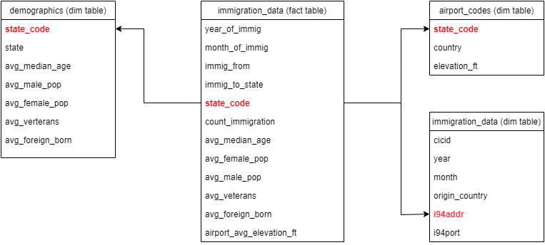

# Data Engineering Capstone Project

#### Project Summary
In this project, 3 data sources are processed that show information about:
- the count of immigration in April of 2016 to the United States Of America
- the demographic ratio of female, male and veterans in the respective state in the month of immigration
- the average airport elevation in feet of the respective state

The project follows the follow steps:
* Step 1: Scope the Project and Gather Data
* Step 2: Explore and Assess the Data
* Step 3: Define the Data Model
* Step 4: Run ETL to Model the Data
* Step 5: Complete Project Write Up

### Step 1: Scope the Project and Gather Data

#### Scope 
Data from various sources are used also fact and dimension tables are created to show the development of immigration.
#### Describe and Gather Data 

1 - I94 Immigration Data: comes from the U.S. National Tourism and Trade Office and contains various statistics on international visitor arrival in USA and comes from the US National Tourism and Trade Office. The dataset contains data from 2016.
2 - World Temperature Data: comes from Kaggle and contains average weather temperatures by city.
3 - U.S. City Demographic Data: comes from OpenSoft and contains information about the demographics of all US cities such as average age, male and female population.
4 - Airport Code Table: This is a simple table of airport codes and corresponding cities.

### Step 2: Explore and Assess the Data

#### Explore the Data 
Identify data quality issues, like missing values, duplicate data, etc.

#### Cleaning Steps
I94 Immigration Data:
- filtering nulls of state codes and aiport codes
- transform country codes to country of origin
- select important columns and drop duplicates

World Temperature Data:
- ordering year descending
- no data from 2016 are available. 
  Further processing is not possible with the immigration data from 2016.
  The temperature data will not be processed further.

U.S. City Demographic Data:
- ordering demographic data
- calculating percentages 
- drop duplicates

Airport Code Data:
- filtering US airports !=closed
- splitting iso-region into state codes
- calculating percanteges of airport elevation in feet

### Step 3: Define the Data Model
#### 3.1 Conceptual Data Model
Due to simplicity, the following star scheme is used

#### 3.2 Mapping Out Data Pipelines
These following steps are necessary to pipeline the data into the chosen data model:

1. Creating three dimension tables I94_Data, DEMO_Data, AIRPORT_Data
2. Creating the fact table I94_IMMIGRATION_DATA using SQL (SELECT and JOIN)
3. Creating a new Spark Dataframe
4. Writing the Dataframe into parquet files

### Step 4: Run Pipelines to Model the Data 
#### 4.1 Create the data model
Build the data pipelines to create the data model.

#### 4.2 Data Quality Checks
- searching for nulls in year_of_immig, month_of_immig, immig_from, immig_to_state
- for the correctness of all 4 datasets a false must be returned
- counting all immigrations in the fact table
- counting all immigrations in the dimension table of I94 Immigration

#### 4.3 Data dictionary

##### Fact Table

##### I94_IMMIGRATION_DATA
 
 |-- year_of_immig: integer (nullable = true) | year of immigration from Immigration Data table
 
 |-- month_of_immig: integer (nullable = true) | month of immigration from Immigration Data table
 
 |-- immig_from: string (nullable = true) | country of origin from Immigration Data table
 
 |-- immig_to_state: string (nullable = true) | US state Code of immigration from Immigration Data table
 
 |-- count_immigration: long (nullable = false) | Count of immigrations
 
 |-- state_code: string (nullable = true) | US state code of immigration from Immigration Data table
 
 |-- avg_median_age: double (nullable = true) | average of median age in US state from Demographic Data table
 
 |-- avg_female_pop: double (nullable = true) | average % of female population of US state  from Demographic Data table
 
 |-- avg_male_pop: double (nullable = true) | average % of male population of US state from Demographic Data table
 
 |-- avg_veterans: double (nullable = true) | average % of veterans of US state from Demographic Data table
 
 |-- avg_foreign_born: double (nullable = true) | average % of foreign born population of US state from Demographic Data table
 
 |-- avg_airport_elevation_ft: double (nullable = true) | average elevation in feet of airport location of US state from Aiport Data table

##### Dimension tables

##### I94 Immigration Data table

 |-- cicid: double (nullable = true)
 
 |-- year: integer (nullable = true) | year of immigration
 
 |-- month: integer (nullable = true) | month of immigration
 
 |-- origin_country: string (nullable = true) | country of origin
 
 |-- state_code: string (nullable = true) | US state Code
 
 |-- i94port: string (nullable = true) | City Port Code of Immigration
 
 |-- city_dest_airport: string (nullable = true) | City of destination Airport

##### U.S. City Demographic Data table

 |-- State: string (nullable = true) | US state Name
 
 |-- state_code: string (nullable = true) | US state Code
 
 |-- avg_median_age: double (nullable = true) | average of median age
 
 |-- avg_male_pop: double (nullable = true) | average % of male population
 
 |-- avg_female_pop: double (nullable = true) | average % of female population
 
 |-- avg_veterans: double (nullable = true) | average % of veterans
 
 |-- avg_foreign_born: double (nullable = true) | average % of foreign born

##### Airport Code table
 |-- country: string (nullable = true) | Airports in the United States
 
 |-- state_code: string (nullable = true) | US state Code
 
 |-- avg_elevation_ft: double (nullable = true) average elevation in feet of airport location

#### Step 5: Complete Project Write Up
1. Clearly state the rationale for the choice of tools and technologies for the project.
2. Propose how often the data should be updated and why.
3. Write a description of how you would approach the problem differently under the following scenarios:
 * The data was increased by 100x.
 * The data populates a dashboard that must be updated on a daily basis by 7am every day.
 * The database needed to be accessed by 100+ people.

1.) For a small amount of data, Spark was used for fast reading, processing, output and analysis.
2.) All data should be provided monthly by agencies and organizations.
3.) - For a 100x data set I would use Hadoop to create a distributed processing system for faster processing.
    - For a daily update I would use Airflow. For a structured update for all data, this can be used to create a schedule.
    - For more than 100 data access I would use a web application (GUI). Amazon AWS is suitable for this.

